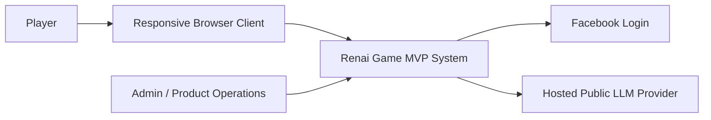
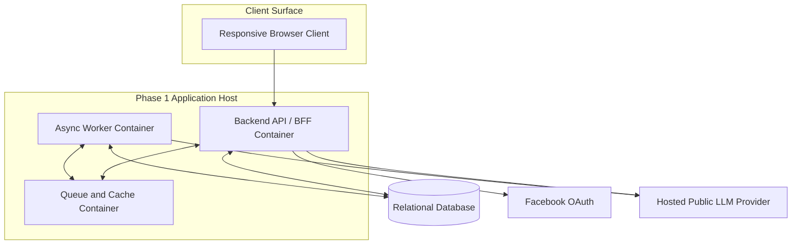
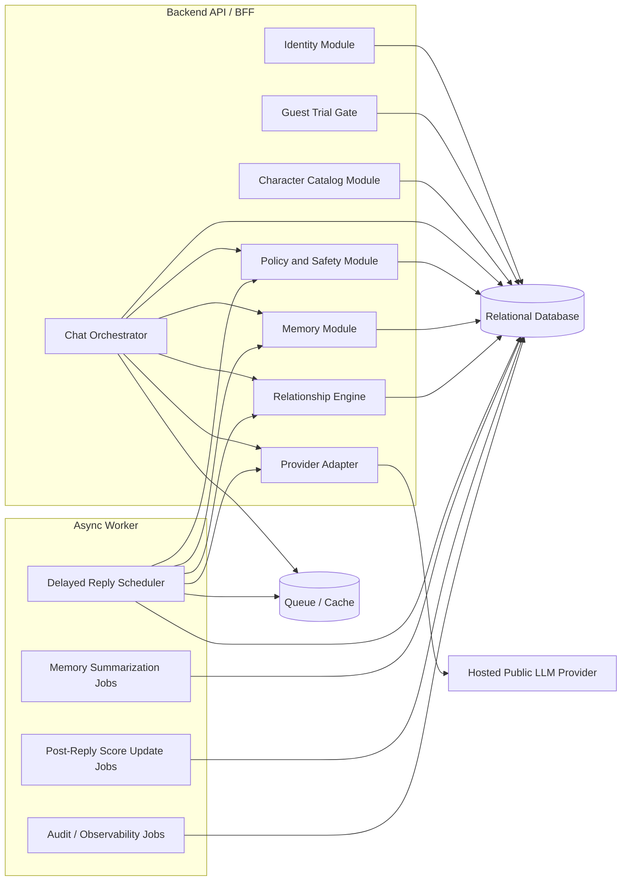
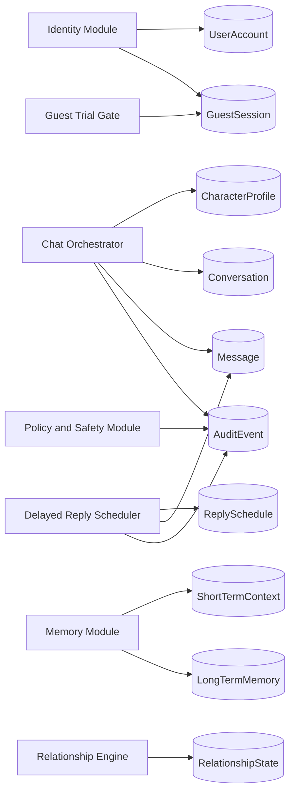
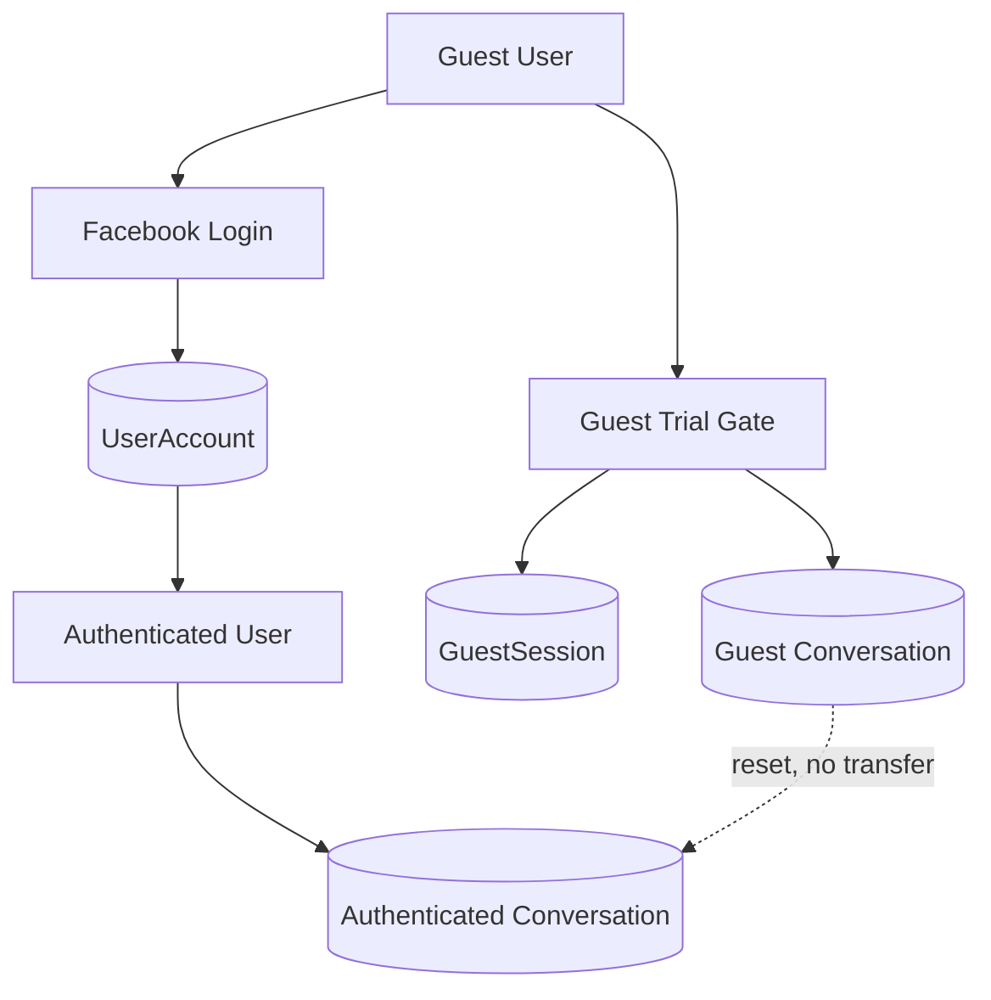
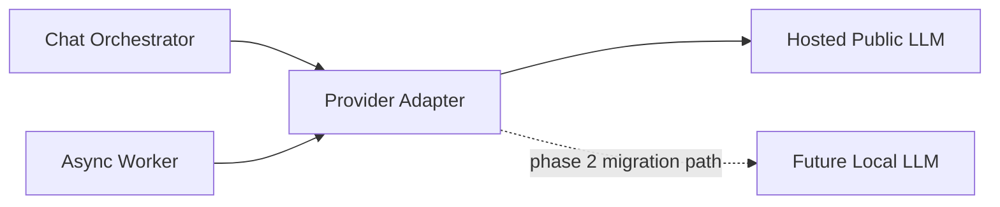

# Renai Game LLM MVP - Component Diagrams

## Document Status
- Status: Draft Component Diagram Companion
- Date: 2026-04-26
- Based On: Phase 1 MVP PRD, MVP HLD, MVP ERD, and MVP Sequence Flows

## Executive Summary
This document provides visual component views for the phase 1 MVP system. It complements the written HLD, ERD, and runtime sequence flows by showing the static architecture boundaries, major internal modules, external dependencies, and deployment-oriented container layout.

The diagrams are grounded in the approved MVP scope:
- responsive browser client
- Facebook-based returning identity
- guest trial before login with a 10-input cap
- one-on-one character chat only
- conversation-scoped memory
- delayed reply scheduling
- hosted public LLM in phase 1
- local LLM migration path in phase 2

## Source Notes
- `docs/01_requirements/renai-game-llm-prd.md`
- `docs/02_architecture/renai-game-llm-mvp-hld.md`
- `docs/02_architecture/renai-game-llm-mvp-erd.md`
- `docs/02_architecture/renai-game-llm-mvp-sequence-flows.md`
- `docs/02_architecture/renai-game-llm-mvp-privacy-retention-architecture.md`

## Scope
This document includes:
- system context diagram
- phase 1 container and deployment view
- backend module/component view
- data and scheduling interaction view

This document does not include:
- endpoint-level API contracts
- file-by-file implementation detail
- premium billing systems
- multi-provider identity linking implementation beyond the future architectural placeholder

## Diagram 1: System Context
### Purpose
Shows the MVP system boundary and its major external actors and dependencies.

### Notes
- The browser client is the only phase 1 user-facing runtime surface.
- Facebook is the only active returning-identity provider in phase 1.
- The hosted LLM provider is external to the MVP system boundary and is accessed through an internal provider abstraction layer.

## Diagram 2: Phase 1 Container View
### Purpose
Shows the major runtime containers for the recommended modular-monolith-plus-worker deployment.

### Notes
- The API and worker are logically separate runtime components even if they live in the same codebase.
- The queue/cache container supports delayed replies, transient counters, and short-latency job dispatch.
- The relational database remains the system of record for identities, conversations, memories, and relationship state.

## Diagram 3: Backend Component View
### Purpose
Shows the major internal components inside the modular monolith and how they collaborate.

### Notes
- `Chat Orchestrator` is the core coordination boundary for synchronous request handling.
- `Delayed Reply Scheduler` in the worker is the core coordination boundary for asynchronous character replies.
- `Provider Adapter` isolates Gemini or any other hosted provider from the rest of the product logic.

## Diagram 4: Conversation State And Data Interaction View
### Purpose
Shows how the main state objects relate to the runtime modules that create or update them.

### Notes
- `Conversation` is the anchor for all conversation-scoped state.
- `LongTermMemory` and `RelationshipState` are intentionally separate so one remains narrative and the other remains structured.
- `AuditEvent` exists as a cross-cutting trace sink for policy, scoring, and delayed-reply actions.

## Diagram 5: Identity And Guest Access Boundary
### Purpose
Shows the separation between guest and authenticated usage, including the approved reset-at-login behavior.

### Notes
- This is a product-rule boundary, not just a UI choice.
- Guest trial state and authenticated state must remain separate in phase 1.

## Diagram 6: Provider Abstraction And Future Migration Path
### Purpose
Shows how the system stays provider-portable between phase 1 hosted LLM usage and future local LLM migration.

### Notes
- No product-facing module should depend directly on a specific LLM provider SDK.
- The provider adapter is the migration seam for phase 2.

## Architectural Boundaries
### Stable MVP Boundaries
- one browser client
- one modular monolith backend codebase
- one async worker role
- one relational source of truth
- no shared-world memory
- no cross-character memory
- conversation-owned lifecycle controls govern memory, relationship, and scheduled-reply cleanup

### Planned Future Extension Boundaries
- linked multi-provider identity
- local LLM support
- premium-visible score display
- possible later decomposition of worker-heavy responsibilities

## Diagram Interpretation Guidance
### How To Read These Diagrams
- The system context diagram answers who is outside the MVP system.
- The container view answers what runs in phase 1.
- The backend component view answers which backend modules own which concerns.
- The data interaction view answers which modules write or read which major entities.
- The identity boundary diagram clarifies the guest-reset rule.
- The provider abstraction diagram shows the deliberate seam for phase 2 migration.

## Open Questions
1. Can the phase 1 hosted model and provider policy support the intended adult-content policy for players who confirm they are 18+, or must adult sexual content wait for a later phase or local model?

## Recommendation Summary
Recommendation:
Use these component diagrams as the static visual reference for implementation planning and technical discussion. Together with the HLD, ERD, and sequence flows, they form a complete phase 1 architecture packet for downstream engineering handoff.