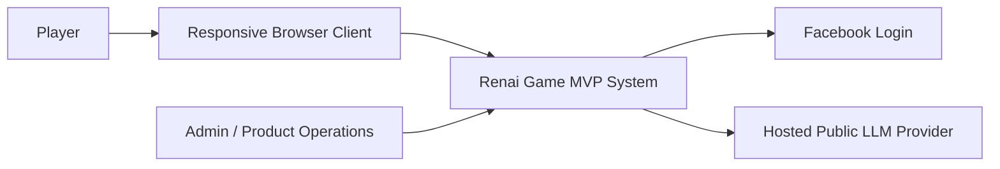
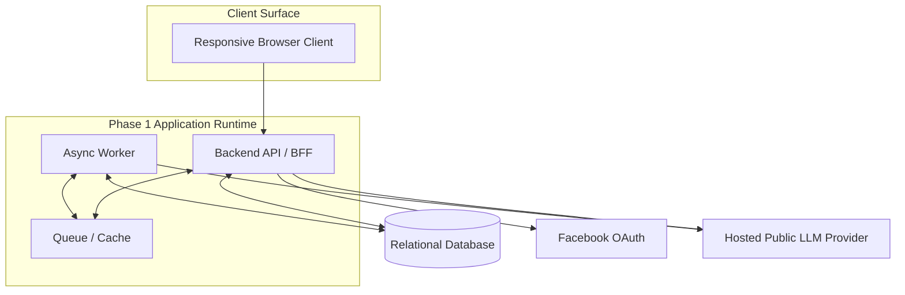
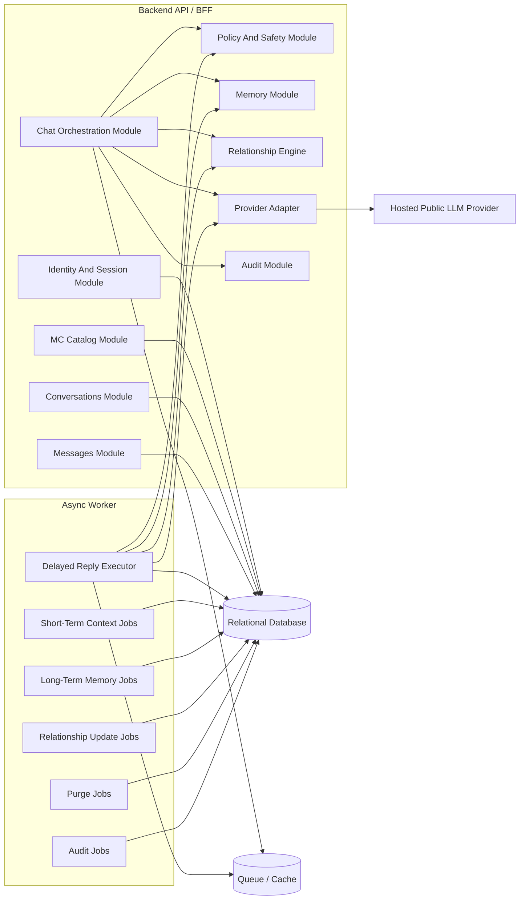
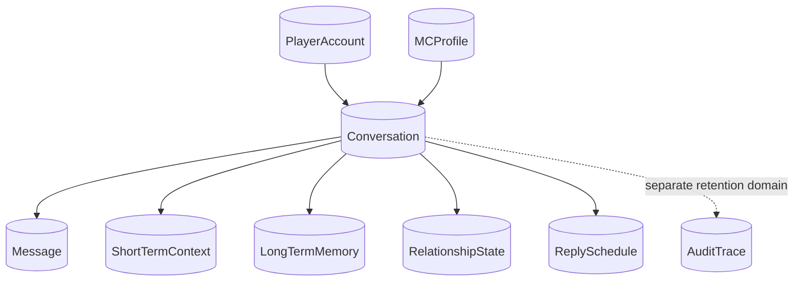

# Renai Game LLM MVP - Component Diagrams

## Document Control
- Status: Draft Component Diagram Companion
- Version: v1.1.0
- Last Updated: 2026-04-26
- Owner: SA

## Change Log
| Date | Version | Change Type | Summary | Downstream Impact |
| --- | --- | --- | --- | --- |
| 2026-04-26 | v1.1.0 | Major | Reconciled the component diagrams to PRD v3.0.2 by removing guest-mode structures, adopting Player and MC terminology, and showing the authenticated-only chat and lifecycle boundaries. | Sequence flows, API planning, and implementation modules should use these diagrams as the static reference for the updated runtime boundary. |
| 2026-04-26 | v1.0.0 | Major | Established the component diagram companion as a managed architecture artifact. | Technical Lead planning should assume these diagrams reflect the current Architecture v1.0.0 boundaries and deployment shape. |

## Upstream Baseline
- Based On: Phase 1 MVP PRD v3.0.2, MVP HLD v1.1.0, MVP ERD v1.1.0, and MVP Sequence Flows v1.1.0

## Executive Summary
This document provides visual component views for the phase 1 MVP system. It complements the written HLD, ERD, and runtime sequence flows by showing the static architecture boundaries, major internal modules, external dependencies, and lifecycle ownership model for the authenticated-only phase 1 chat system.

The diagrams are grounded in the approved MVP scope:
- responsive browser client
- Facebook-based Player identity
- login required before chat
- one-on-one Player-to-MC chat only
- conversation-scoped memory
- delayed reply scheduling
- hosted public LLM in phase 1 with non-explicit romance only
- admin-managed deletion and explicit retention windows

## Source Notes
- `docs/01_requirements/renai-game-llm-prd.md`
- `docs/02_architecture/renai-game-llm-mvp-hld.md`
- `docs/02_architecture/renai-game-llm-mvp-erd.md`
- `docs/02_architecture/renai-game-llm-mvp-sequence-flows.md`
- `docs/02_architecture/renai-game-llm-mvp-privacy-retention-architecture.md`

## Diagram 1: System Context
### Purpose
Shows the MVP system boundary and its major external actors and dependencies.

### Notes
- The browser client is the only phase 1 Player-facing runtime surface.
- Facebook is the only active identity provider in phase 1.
- The hosted LLM provider is external to the product boundary and is accessed only through an internal adapter.

## Diagram 2: Phase 1 Container View
### Purpose
Shows the major runtime containers for the recommended modular-monolith-plus-worker deployment.

### Notes
- The API and worker are logically separate runtime components even if they live in the same codebase.
- The queue/cache layer supports delayed replies, transient coordination, and purge dispatch.
- The relational database remains the system of record for Players, MCs, conversations, messages, memories, relationship state, and audit traces.

## Diagram 3: Backend Component View
### Purpose
Shows the major internal components inside the modular monolith and how they collaborate.

### Notes
- `Chat Orchestration Module` is the synchronous coordination boundary for Player message submission.
- `Delayed Reply Executor` is the asynchronous coordination boundary for MC reply generation.
- `Purge Jobs` exist because deletion is admin-managed and asynchronous in phase 1.

## Diagram 4: Ownership And Lifecycle View
### Purpose
Shows how Player-facing transcript data, derived state, and audit traces relate to the conversation ownership root.

### Notes
- `Conversation` is the ownership and deletion root for transcript data and derived state.
- `AuditTrace` is retained separately and should remain metadata-first.
- No guest-session ownership path exists in phase 1.

## Stable MVP Boundaries
- one browser client
- one modular monolith backend codebase
- one async worker role
- one relational source of truth
- no guest or anonymous chat path
- no cross-MC memory
- no explicit adult sexual content in phase 1 hosted mode

## Recommendation Summary
Recommendation:
Use these component diagrams as the static visual reference for implementation planning and technical review. Together with the HLD, ERD, and sequence flows, they describe the authenticated-only phase 1 system boundary approved by the current PRD.
