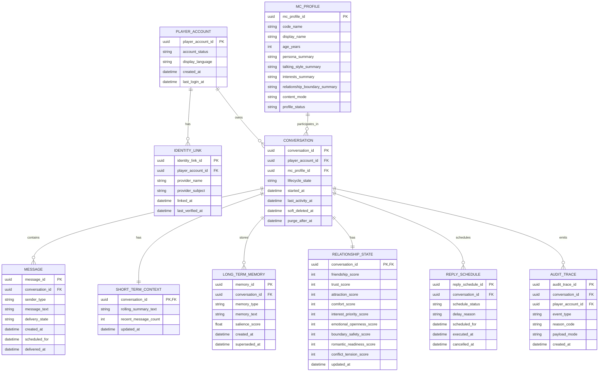

# Renai Game LLM MVP - Data Model And ERD

## Document Control
- Status: Draft ERD
- Version: v1.1.0
- Last Updated: 2026-04-26
- Owner: SA

## Change Log
| Date | Version | Change Type | Summary | Downstream Impact |
| --- | --- | --- | --- | --- |
| 2026-04-26 | v1.1.0 | Major | Reconciled the ERD to PRD v3.0.2 by removing guest-session ownership, adopting Player and MC terminology, and aligning lifecycle entities to the approved retention and deletion policy. | HLD, sequence flows, API contracts, persistence planning, and lifecycle enforcement should treat the authenticated Player-MC conversation root as the only phase 1 chat ownership path. |
| 2026-04-26 | v1.0.0 | Major | Established the ERD as a managed architecture baseline for the MVP data model. | Technical Lead planning and any future implementation work should treat the ERD as the current Architecture v1.0.0 data-model baseline. |

## Upstream Baseline
- Based On: Phase 1 MVP PRD v3.0.2 and MVP HLD v1.1.0

## Executive Summary
This document defines the conceptual data model and entity relationships for the phase 1 MVP of the renai-game-style LLM chat product. The model is conversation-centric and authenticated-only: one Player account owns one durable conversation root per MC, and all memory, relationship state, delayed replies, and lifecycle behavior cascade from that root.

## Source Notes
- `docs/01_requirements/renai-game-llm-prd.md`
- `docs/02_architecture/renai-game-llm-mvp-hld.md`
- `docs/02_architecture/renai-game-llm-mvp-privacy-retention-architecture.md`

## Modeling Scope
This ERD covers the phase 1 MVP logical data model for:
- Player identity
- MC catalog
- one-on-one conversations
- messages
- short-term and long-term memory
- relationship-state metrics
- delayed reply scheduling
- audit-minimum trace storage

This ERD does not cover:
- guest or anonymous chat entities
- cross-MC memory
- shared-world memory
- premium score display or billing models

## Data Model Principles
### 1. Player-MC Conversation Root
The central persistence unit is a conversation between exactly one Player account and exactly one MC profile.

### 2. Derived State Follows The Conversation
Short-term context, long-term memory, relationship state, and reply schedules are all owner-bound to the conversation root.

### 3. Memory Isolation Is Structural
No entity path allows long-term memory or relationship state to cross MC boundaries.

### 4. Lifecycle Is First-Class
Conversation lifecycle fields support active use, admin-managed deletion, purge orchestration, and retention enforcement without redefining the schema later.

## Entity Relationship Diagram

## Entity Definitions
### PlayerAccount
Persistent authenticated Player identity.

### IdentityLink
Provider-agnostic mapping between a Player account and Facebook in phase 1, with room for later linked providers.

### MCProfile
Curated MC roster and persona metadata used for discovery, prompt assembly, and relationship-bound behavior.

### Conversation
The ownership root for one Player-MC relationship thread.

Notes:
- one active conversation root per Player-MC pair is recommended in phase 1
- lifecycle fields support admin-managed delete and purge

### Message
Append-only transcript entries for Player, MC, or system-generated events.

### ShortTermContext
Compact recent-context summary stored as prompt-ready text for the active conversation.

### LongTermMemory
Durable, prompt-ready memory artifacts scoped to one Player-MC conversation.

### RelationshipState
Structured hidden phase 1 metrics for one Player-MC conversation.

### ReplySchedule
Delayed reply job metadata and status transitions.

### AuditTrace
Metadata-first operational and safety trace storage kept separate from the Player-visible transcript store.

## Key Relationship Rules
### Conversation Ownership Rule
Each conversation belongs to exactly one Player account and exactly one MC profile.

### Memory Isolation Rule
`ShortTermContext`, `LongTermMemory`, and `RelationshipState` are all keyed from `Conversation`.

Result:
No cross-MC memory path exists in the MVP schema.

### Re-entry Rule
Returning Players reopen the same durable conversation root for the same MC unless a later reset or archival feature is introduced.

### Lifecycle Rule
Deletion and purge behavior cascade from `Conversation` to:
- `Message`
- `ShortTermContext`
- `LongTermMemory`
- `RelationshipState`
- `ReplySchedule`

`AuditTrace` remains separately retained under its own 90-day rule.

## Recommended Constraints
### Required Uniqueness
- `identity_link(provider_name, provider_subject)` must be unique.
- `mc_profile.code_name` must be unique.
- one active conversation per `(player_account_id, mc_profile_id)` should be enforced.
- `relationship_state.conversation_id` and `short_term_context.conversation_id` are unique by definition.

### Recommended Check Constraints
- all relationship metrics are bounded between 0 and 100
- `reply_schedule.scheduled_for` cannot be earlier than the scheduling event timestamp
- `conversation.lifecycle_state` is restricted to the approved lifecycle enum
- `message.sender_type` is restricted to `player`, `mc`, or `system`

## Lifecycle And Retention Notes
### Conversation History
- retained for 12 months after `last_activity_at` unless earlier admin-managed deletion is triggered

### Derived State
- `ShortTermContext`, `LongTermMemory`, and `RelationshipState` are hard-deleted within 30 days after confirmed deletion of the owning conversation or account

### Audit Traces
- retained for 90 days
- should remain metadata-first and avoid duplicating raw chat text by default

## Architecture Trade-Offs Reflected In The ERD
### Why Not Separate Guest And Authenticated Ownership?
Guest mode is no longer part of the approved phase 1 product. Removing guest ownership simplifies authorization, lifecycle enforcement, and restore behavior.

### Why Keep RelationshipState Separate From LongTermMemory?
Relationship metrics are structured and frequently updated, while long-term memory is narrative and salience-based. Keeping them separate improves tuning, debugging, and future premium-display flexibility.

### Why Keep AuditTrace Separate From Message?
Audit storage and transcript storage have different retention and access requirements. The schema should preserve that separation directly.

## Recommendation Summary
Recommendation:
Treat `Conversation` as the sole continuity and deletion root for the phase 1 chat product, keep all derived memory and relationship state anchored to that root, and enforce Player-MC isolation structurally rather than by convention.
