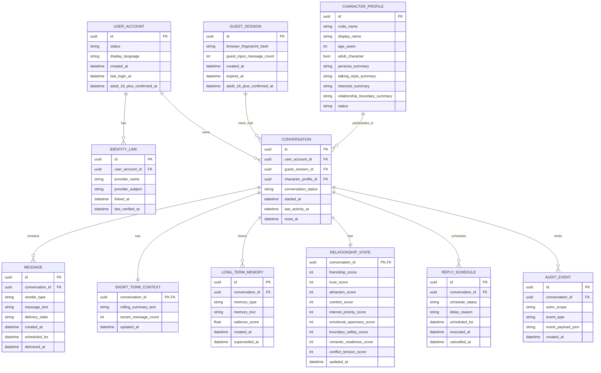

# Renai Game LLM MVP - Data Model And ERD

## Document Control
- Status: Draft ERD
- Version: v1.0
- Last Updated: 2026-04-26
- Owner: SA

## Change Log
| Date | Version | Change Type | Summary | Downstream Impact |
| --- | --- | --- | --- | --- |
| 2026-04-26 | v1.0 | Major | Established the ERD as a managed architecture baseline for the MVP data model. | Technical Lead planning and any future implementation work should treat the ERD as the current Architecture v1.0 data-model baseline. |

## Upstream Baseline
- Based On: Phase 1 MVP PRD v1.0 and MVP HLD v1.0

## Executive Summary
This document defines the conceptual data model and entity relationships for the phase 1 MVP of the renai-game-style LLM chat product. The design reflects the approved product boundaries: one-on-one chat, user-character memory isolation, guest trial plus Facebook login, hidden relationship scores in phase 1, delayed replies, and no shared-world or cross-character memory.

The recommended model is relational-first, with conversation state, memories, relationship state, and scheduled replies all centered on a single conversation root for one player and one character.

## Source Notes
- `docs/01_requirements/renai-game-llm-prd.md`
- `docs/02_architecture/renai-game-llm-mvp-hld.md`
- `docs/02_architecture/renai-game-llm-mvp-privacy-retention-architecture.md`

## Modeling Scope
This ERD covers the phase 1 MVP logical data model for:
- player identity and guest sessions
- character catalog
- one-on-one conversations
- messages
- short-term and long-term memory
- relationship state metrics
- reply scheduling
- auditability and policy state

This ERD does not include:
- cross-character memory
- shared-world memory
- premium billing or premium score display
- native mobile-device data models

## Data Model Principles
### 1. Conversation-Centric Design
The central persistence unit is a conversation between exactly one player identity context and exactly one character profile.

### 2. Memory Isolation By Design
All memory and relationship state is scoped to a single conversation root, which enforces the phase 1 rule that memory does not cross characters.

### 3. Guest And Authenticated Paths Share The Same Chat Shape
Guest trial and authenticated users both create conversations and messages. The difference is ownership and lifecycle, not chat structure.

### 4. Relationship State Is Separate From Raw Message History
Messages are append-only conversational records. Relationship scores are stored separately as derived state so they remain easy to tune and inspect.

### 5. Provider Independence Must Not Leak Into Core Data Structures
The core schema should not depend on Gemini-specific request or response structures.

## Entity Relationship Diagram

## Entity Definitions
### UserAccount
Purpose:
Persistent authenticated player identity.

Notes:
- Phase 1 uses Facebook login for returning identity.
- `adult_18_plus_confirmed_at` captures the self-attested phase 1 age-gate confirmation.

### IdentityLink
Purpose:
Provider-agnostic identity mapping.

Notes:
- Phase 1 only needs Facebook in active use.
- The entity exists now to avoid schema redesign when LINE and email are added later.

### GuestSession
Purpose:
Anonymous trial identity for pre-login usage.

Notes:
- Stores the guest trial counter used to enforce the 10-input cap.
- Can also carry a guest-local age confirmation timestamp.
- Guest data resets on login and is not migrated into the authenticated account.

### CharacterProfile
Purpose:
Stores the curated character roster and product-facing persona boundaries.

Notes:
- The MVP roster is Aira, Lyra, and Nova.
- `adult_character` supports age-gated romantic policy decisions.

### Conversation
Purpose:
One conversation root for one identity context and one character.

Notes:
- Exactly one of `user_account_id` or `guest_session_id` should be populated.
- This entity is the isolation boundary for memory and relationship state.

### Message
Purpose:
Append-only chat history.

Notes:
- `sender_type` should distinguish at minimum user, character, and system-generated events.
- `scheduled_for` and `delivered_at` support delayed reply behavior.

### ShortTermContext
Purpose:
Stores the rolling context representation for active chat coherence.

Notes:
- Kept separate from raw messages so the prompt layer can use a compact recent-context representation.

### LongTermMemory
Purpose:
Stores durable memory items for the specific user-character pair.

Notes:
- Designed as multiple rows, not one giant text blob.
- `superseded_at` allows later memory compaction without losing lineage.

### RelationshipState
Purpose:
Stores current derived relationship metrics for one conversation.

Notes:
- Phase 1 players do not see these scores.
- The schema reflects both visible-candidate and hidden system metrics already approved in the PRD.

### ReplySchedule
Purpose:
Stores delayed reply jobs and status transitions.

Notes:
- Keeps delayed reply behavior explicit and auditable.
- Supports the maximum 5-minute low-interest delay rule.

### AuditEvent
Purpose:
Stores safety, policy, and system trace events.

Notes:
- Useful for moderation review, debugging, and score-change audits.

## Key Relationship Rules
### Conversation Ownership Rule
Each conversation belongs to exactly one of:
- one authenticated `UserAccount`, or
- one anonymous `GuestSession`

Recommendation:
Enforce this with a database check constraint so both owner references cannot be populated at once.

### Memory Isolation Rule
`ShortTermContext`, `LongTermMemory`, and `RelationshipState` are all keyed from `Conversation`.

Result:
No cross-character memory path exists in the MVP schema.

### Character Re-entry Rule
Authenticated users can have repeated conversations or one long-lived conversation per character, depending on application policy.

Recommendation:
Treat one user-character pair as one durable conversation root in phase 1 unless explicit archival or reset behavior is introduced later.

### Guest Reset Rule
When a guest logs in:
- guest conversation state does not transfer
- guest memories do not transfer
- guest relationship state does not transfer

This is represented by keeping guest-owned conversation records separate from authenticated ones.

## Recommended Relational Constraints
### Required Uniqueness
- `identity_link(provider_name, provider_subject)` must be unique.
- `character_profile.code_name` should be unique.
- `relationship_state.conversation_id` must be unique by definition.
- `short_term_context.conversation_id` must be unique by definition.

### Recommended Check Constraints
- exactly one of `conversation.user_account_id` or `conversation.guest_session_id` is non-null
- all relationship scores are bounded between 0 and 100
- `guest_session.guest_input_message_count` cannot be negative
- `reply_schedule.scheduled_for` cannot be earlier than the creation time of the scheduled reply event

## Data Lifecycle Notes
### Guest Trial Lifecycle
- create guest session
- increment input counter per user input message
- create guest-owned conversation and messages
- require login after the tenth input message
- on login, reset by starting an authenticated conversation rather than migrating guest state

### Authenticated Conversation Lifecycle
- create or load durable conversation for user-character pair
- append messages
- refresh short-term context
- persist long-term memories asynchronously
- update relationship state after each completed exchange

### Delayed Reply Lifecycle
- user message arrives
- relationship engine determines delay profile
- `reply_schedule` row is created
- worker executes at scheduled time
- resulting character message is persisted

## Data Governance Notes
The companion privacy and retention architecture now defines lifecycle ownership, retention classes, guest-expiry behavior, and delete-state expectations for the MVP.

Recommendation:
- include lifecycle-oriented columns such as timestamps and status fields so retention and deletion policy can be enforced without structural redesign
- treat `Conversation` as the deletion and purge root for `ShortTermContext`, `LongTermMemory`, `RelationshipState`, and `ReplySchedule`
- keep `AuditEvent` payloads metadata-first where possible so audit storage does not become a duplicate transcript store

## Architecture Trade-Offs Reflected In The ERD
### Why Not A Generic Memory Graph?
A generic memory graph would be more flexible long-term, but it adds unnecessary complexity for the MVP. The approved product scope requires strict per-conversation memory isolation.

### Why Separate RelationshipState From LongTermMemory?
Relationship metrics are structured and frequently updated. Long-term memory is narrative and salience-based. Keeping them separate improves tuning, debugging, and future premium display.

### Why Keep GuestSession Separate From UserAccount?
Because guest state must reset at login, a separate guest entity cleanly models the product rule without forced migration logic.

## Open Questions
1. Can the phase 1 hosted model and provider policy support the intended adult-content policy for players who confirm they are 18+, or must adult sexual content wait for a later phase or local model?
2. What concrete retention durations should be assigned to guest-limited, account-durable, and audit-minimum data classes at implementation time?
3. Should phase 1 expose any user-facing delete capability, or should delete remain an internal or admin-managed lifecycle path until later?

## Recommendation Summary
Recommendation:
Use a relational, conversation-centric schema with separate guest and authenticated identity paths, explicit delayed-reply scheduling, conversation-scoped memory, and a dedicated structured relationship-state table. This model is the simplest shape that satisfies the MVP while preserving a clean path to later scale and provider migration.