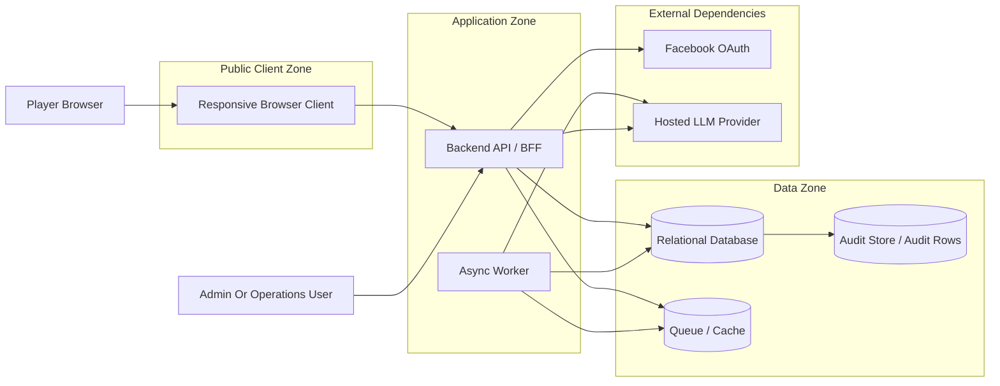

# Renai Game LLM MVP - Security Architecture

## Document Status
- Status: Draft Architecture Companion
- Date: 2026-04-26
- Based On: Phase 1 MVP PRD and MVP architecture packet

## Executive Summary
This document defines the phase 1 security architecture for the renai-game-style LLM MVP. The system handles conversational data, guest and authenticated identity state, relationship signals, provider credentials, and safety-sensitive model interactions. The phase 1 security design therefore focuses on trust boundaries, access control, session integrity, secret handling, abuse resistance, and secure operational review.

The architecture remains intentionally simple for the MVP, but it must still ensure:
- no direct browser access to the LLM provider
- strict ownership checks for guest and authenticated conversations
- server-side control of delayed replies and background jobs
- minimized audit payloads
- security controls that work alongside the safety and policy layer

## Source Notes
- `docs/01_requirements/renai-game-llm-prd.md`
- `docs/02_architecture/renai-game-llm-mvp-hld.md`
- `docs/02_architecture/renai-game-llm-mvp-erd.md`
- `docs/02_architecture/renai-game-llm-mvp-sequence-flows.md`
- `docs/02_architecture/renai-game-llm-mvp-component-diagrams.md`
- `docs/02_architecture/renai-game-llm-mvp-privacy-retention-architecture.md`
- `docs/02_architecture/adr-0001-phase1-hosted-model-adult-content-fallback.md`

## Problem Statement
The MVP is not a simple stateless chat proxy. It maintains identity-linked continuity, memory, relationship state, delayed reply jobs, and provider credentials. That creates a security surface that includes unauthorized chat access, guest abuse, session confusion between guest and authenticated states, prompt or provider misuse, secret leakage, and over-retention of sensitive conversational data.

## Scope
This document covers:
- trust boundaries and system zones
- guest and authenticated session security
- conversation ownership and authorization rules
- provider credential and secret handling
- abuse prevention and rate controls
- audit and privileged access boundaries
- lifecycle-aware security checks for deletion and purge

This document does not cover:
- detailed cryptographic implementation choices
- vendor-specific WAF or CDN configuration
- legal compliance advice
- future native mobile application security design

## Security Goals
- prevent unauthorized access to conversation, memory, and relationship data
- prevent client-side exposure of provider credentials or internal job endpoints
- maintain separation between guest-owned and authenticated-owned data
- block delayed job execution against expired or deleted ownership scopes
- minimize privileged access to raw conversational data
- keep abuse resistance strong enough for a public MVP surface

## Trust Zones And Boundaries

### Boundary Rules
- the browser talks only to the backend API surface
- the browser never talks directly to the hosted LLM provider
- the worker is trusted only for scheduled and internal job execution
- admin or operations access must be separate from normal player access paths

## Security Principles
- enforce ownership at the conversation root
- keep provider credentials server-side only
- minimize retained sensitive data
- recheck lifecycle state before asynchronous execution
- prefer least-privilege access between runtime roles
- separate user-facing chat history from audit-oriented traces

## Asset Classes
### Identity And Session Assets
- guest session identifiers
- authenticated account identity
- provider identity links
- age-confirmation timestamps

### Conversational Assets
- messages
- short-term context
- long-term memory
- relationship state

### Operational And Secret Assets
- provider API credentials
- queue or cache credentials
- admin access credentials
- audit traces and safety events

## Identity And Session Security Architecture
### Guest Sessions
Guest sessions are public-entry identity contexts with limited trust.

Security requirements:
- guest session identifiers must be treated as server-validated state, not as trusted standalone authority
- guest state must remain isolated from authenticated account data
- guest sessions must expire and become ineligible for further writes after lifecycle end
- the 10-input limit should be enforced server-side, not only in the client

### Authenticated Sessions
Authenticated identity begins with Facebook in phase 1.

Security requirements:
- Facebook identity must resolve into an internal account model
- authorization checks must use internal account ownership, not raw provider identifiers
- guest login reset must not accidentally merge guest data into authenticated continuity

### Session Transition Boundary
Guest-to-authenticated transition is a security boundary as well as a product boundary.

Rule:
On login, the new authenticated session starts with authenticated ownership only. Guest-owned conversations, memory, and relationship state must not become reachable through the authenticated session.

## Authorization Model
### Conversation Ownership Rule
Every conversation belongs to exactly one ownership scope:
- one `GuestSession`, or
- one `UserAccount`

### Authorization Requirement
Every read, write, delayed-reply execution, and background update must verify that:
- the caller or worker is operating on the correct ownership scope
- the conversation is still active and not soft-deleted or purge-pending

### Derived Data Rule
`ShortTermContext`, `LongTermMemory`, and `RelationshipState` are not independent authorization roots. Access to them is always mediated through conversation ownership.

## Provider And Secret Security
### Hosted LLM Provider Boundary
The provider adapter is the only approved provider integration boundary.

Security requirements:
- provider credentials remain server-side only
- raw provider credentials are unavailable to the browser
- provider request construction happens inside backend or worker-controlled modules only
- provider responses pass through policy and safety validation before persistence

### Secret Management Requirements
Recommendation:
- use environment-managed or secret-store-managed credentials rather than source-controlled values
- separate secret scopes for API, worker, database, and provider access where practical
- support credential rotation without redesigning module boundaries

## Data Protection And Lifecycle Security
### Ownership-Cascade Security
Deletion and purge are security-relevant because stale derived memory can leak personal or behavioral context even after raw chat access is removed.

Rules:
- deleting or purging a conversation must cascade to short-term context, long-term memory, relationship state, and scheduled replies
- audit traces should retain only the minimum operational value necessary
- guest-owned data must not survive as authenticated continuity

### Delayed Reply Safety Check
Before generating or delivering a delayed reply, the worker must recheck:
- session or account ownership validity
- conversation lifecycle state
- policy mode and current gating constraints

## Abuse Resistance And Public Surface Controls
### Public Entry Risks
- repeated guest-session creation
- message spam or rapid retry behavior
- abusive prompt attempts against safety boundaries
- scraping or enumeration of character and conversation endpoints

### Recommended Controls
- server-side guest quota enforcement
- request rate limiting on identity, chat, and auth endpoints
- ownership checks on all conversation access paths
- stable error handling that does not reveal internal identifiers unnecessarily
- audit events for repeated quota abuse, suspicious access attempts, and policy-triggered refusals

## Audit And Administrative Access
### Audit Design Principle
Audit data should support debugging, abuse review, and moderation without becoming an unrestricted shadow transcript store.

### Administrative Access Rules
- admin and operations access should be separated from player-facing identity flows
- privileged review should prefer audit metadata and reason codes over unrestricted raw chat access
- direct access to raw message history should be limited and justified

## Key Risks And Mitigations
### 1. Unauthorized Conversation Access
Risk:
An attacker or broken client path accesses another user’s conversation.

Mitigation:
Use strict ownership checks based on internal conversation ownership, not client-provided identity hints.

### 2. Guest And Authenticated State Confusion
Risk:
Guest data becomes reachable after login because identity boundaries are enforced only in the UI.

Mitigation:
Keep guest and authenticated ownership distinct in persistence and authorization logic.

### 3. Secret Exposure
Risk:
Provider or infrastructure credentials leak through client code, logs, or admin handling.

Mitigation:
Keep all provider and infrastructure credentials server-side and minimize secret distribution by role.

### 4. Async Job Execution Against Deleted State
Risk:
Delayed replies or background updates execute after a conversation is expired or purge-pending.

Mitigation:
Require lifecycle-state rechecks before worker execution and make cleanup jobs idempotent.

### 5. Audit Over-Collection
Risk:
Audit rows become a second full transcript store with broader access than the primary chat history.

Mitigation:
Prefer metadata-first audit payloads and narrow privileged access paths.

## Assumptions
- transport security is assumed for browser-to-backend and backend-to-external-provider communication
- the exact session token or cookie mechanism remains stack-dependent and is not fixed in this document
- admin tooling is not yet defined in phase 1, so this document specifies boundaries rather than interface details

## Open Questions
1. Which concrete session mechanism will phase 1 use for guest and authenticated browser state?
2. Will phase 1 use a managed secret store, environment-level secret injection, or another secret-distribution mechanism?
3. Should audit traces allow any narrow text excerpts, or should they remain metadata-only in phase 1?
4. Will phase 1 expose any admin or moderation review surface, or remain engineering-only for privileged operations?

## Recommendation Summary
Recommendation:
Keep the phase 1 security model simple but explicit: no direct client-to-provider calls, strict conversation-root authorization, server-side guest quota enforcement, lifecycle-state checks before async execution, server-only secret handling, and minimized privileged access to conversational data.