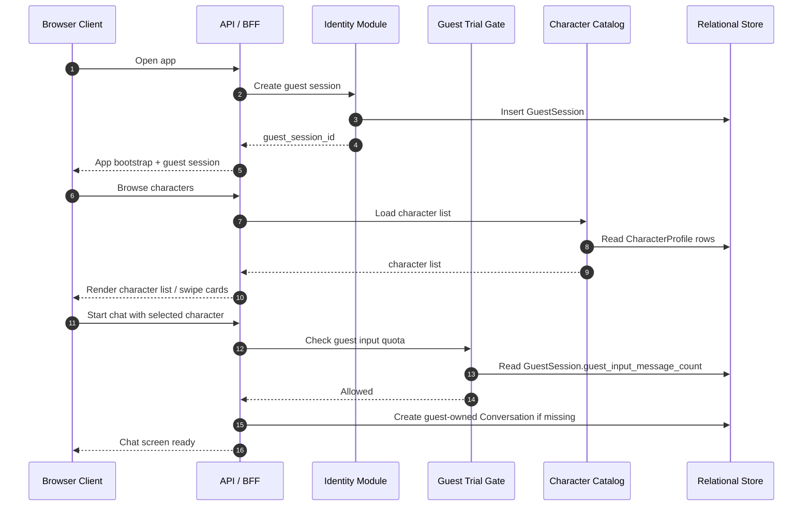
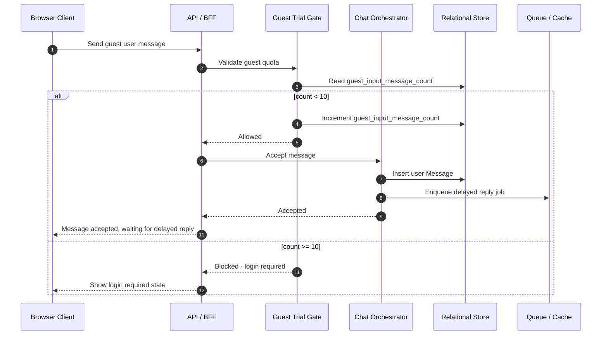
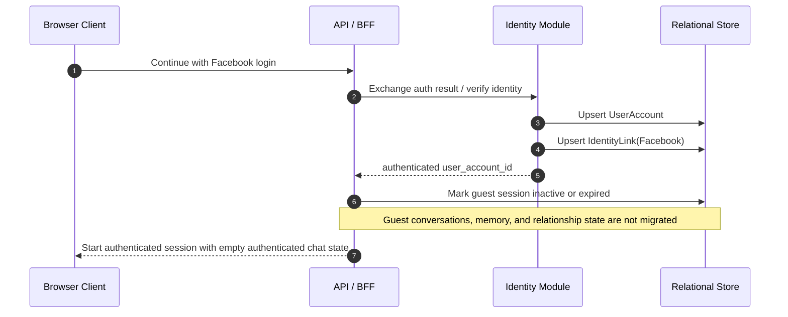
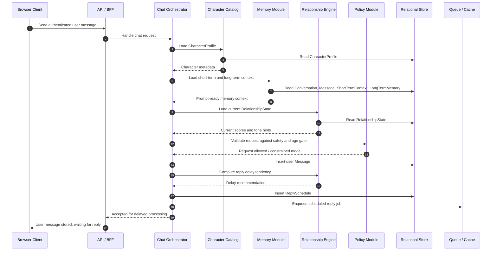
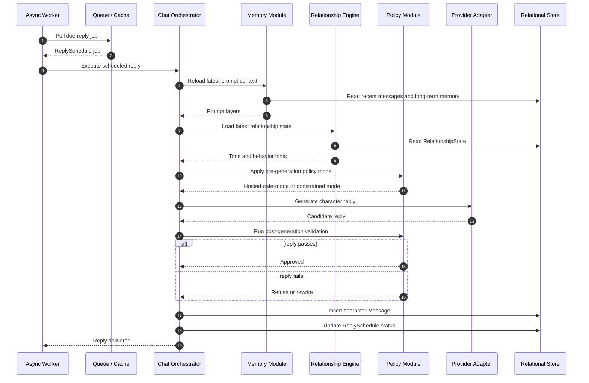
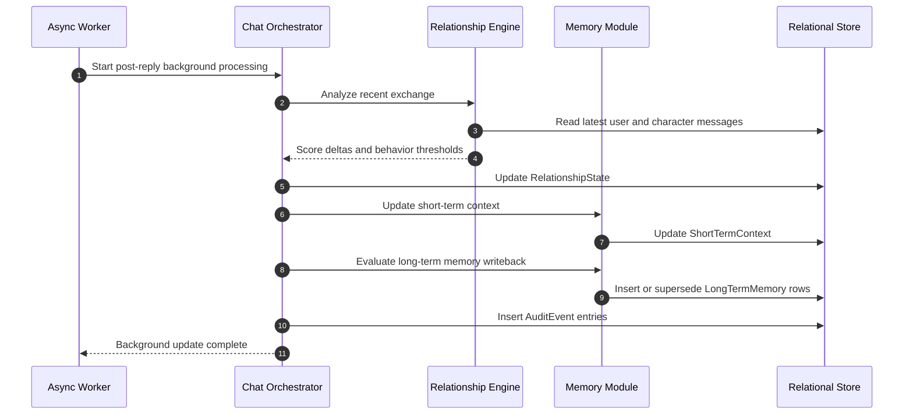
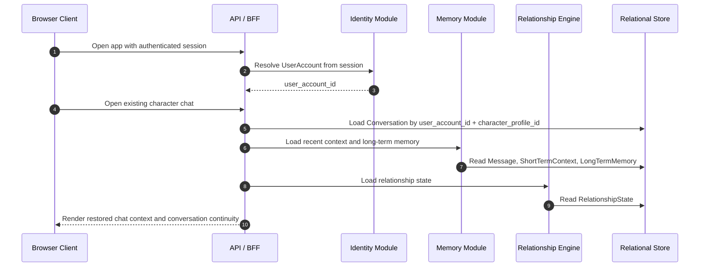

# Renai Game LLM MVP - Sequence Flows

## Document Status
- Status: Draft Sequence Flow Companion
- Date: 2026-04-26
- Based On: Phase 1 MVP PRD, MVP HLD, and MVP ERD

## Executive Summary
This document captures the main runtime sequence flows for the phase 1 MVP system. It complements the HLD and ERD by showing how the browser client, backend modules, storage layers, scheduler, and LLM provider interact during the most important product journeys.

The focus is on the approved MVP behavior:
- guest trial before login
- Facebook-based returning identity
- one-on-one chat only
- delayed human-like replies
- conversation-scoped memory
- hidden phase-1 relationship scores
- guest reset on login

## Source Notes
- `docs/01_requirements/renai-game-llm-prd.md`
- `docs/02_architecture/renai-game-llm-mvp-hld.md`
- `docs/02_architecture/renai-game-llm-mvp-erd.md`
- `docs/02_architecture/renai-game-llm-mvp-privacy-retention-architecture.md`

## Scope
This document covers:
- guest trial start and message cap enforcement
- guest-to-login reset behavior
- authenticated chat request and delayed reply generation
- returning-player conversation restore
- post-reply memory and relationship update processing

This document does not cover:
- premium score visibility flows
- cross-character memory flows
- native mobile app flows
- multi-provider account linking flows beyond Facebook in phase 1

## Participants
| Participant | Role |
| --- | --- |
| Browser Client | Responsive browser app used by player |
| API / BFF | Client-facing backend entrypoint |
| Identity Module | Guest and Facebook identity handling |
| Guest Trial Gate | Enforces pre-login chat cap |
| Character Catalog | Loads character profile and metadata |
| Chat Orchestrator | Coordinates chat request processing |
| Policy Module | Enforces age gate and safety restrictions |
| Relationship Engine | Loads and updates relationship state |
| Memory Module | Loads and updates short-term and long-term memory |
| Provider Adapter | Normalized access to hosted public LLM |
| Async Worker | Executes delayed reply and background jobs |
| Relational Store | Persistent relational database |
| Queue / Cache | Delayed jobs and transient counters |

## Flow 1: Guest Trial Start And First Chat
### Purpose
Shows how an anonymous player starts using the product and sends an initial message before login.

## Flow 2: Guest Message Send And Trial Limit Enforcement
### Purpose
Shows how the 10-input guest cap is enforced and how the user is blocked from continuing without login.

## Flow 3: Guest Login Reset
### Purpose
Shows the approved product rule that guest chat state does not migrate into the authenticated account after Facebook login.

## Flow 4: Authenticated Chat Request And Delayed Reply Scheduling
### Purpose
Shows how the system accepts an authenticated message, assembles the required context, applies policy, and schedules a delayed reply instead of immediately returning provider output.

## Flow 5: Delayed Reply Execution Through Hosted LLM
### Purpose
Shows how the worker executes the scheduled reply, calls the provider, applies post-generation checks, and delivers the character message.

## Flow 6: Post-Reply Memory And Score Update
### Purpose
Shows how relationship state and memory are updated after a completed exchange without blocking the visible user experience.

## Flow 7: Returning Player Reopens Existing Character Chat
### Purpose
Shows how a returning Facebook-authenticated player gets continuity with the same character.

## Sequence Design Notes
### Why Reply Scheduling Happens Before Provider Call
The user experience depends on controlled timing, and some replies must be delayed by minutes. If the provider call happened synchronously inside the client request, the system would be forced into either long client blocking or fake frontend-only delays.

### Why Memory And Relationship Updates Are Post-Reply Jobs
This keeps the visible chat loop faster and reduces prompt assembly latency on the critical path.

### Why Guest Reset Is Explicitly Modeled
The product requirement says guest history, memory, and relationship state reset at login. Modeling this as a first-class sequence avoids accidental migration logic later.

### Why Policy Is Checked Both Before And After Generation
Pre-generation policy shapes what the model is allowed to attempt. Post-generation policy catches unsafe output that still slips through. The combination is necessary because the product relies on non-deterministic LLM behavior.

### Why Lifecycle State Must Be Checked Before Reply Execution
Delayed replies are asynchronous. By the time a job becomes due, the owning guest session or conversation may already be expired, soft-deleted, or purge-pending. The worker must therefore recheck lifecycle state before provider generation or message delivery.

## Cross-Document Consistency Checks
This sequence document is consistent with the companion architecture artifacts in these ways:
- matches the modular monolith plus async worker design in the HLD
- uses the conversation-centric persistence model from the ERD
- preserves guest reset behavior from the PRD
- preserves per-user-per-character memory isolation from the PRD and HLD
- preserves conversation-root lifecycle ownership from the privacy and retention architecture
- keeps phase 1 scores hidden from players

## Open Questions
1. Can the phase 1 hosted model and provider policy support the intended adult-content policy for players who confirm they are 18+, or must adult sexual content wait for a later phase or local model?

## Recommendation Summary
Recommendation:
Use these sequences as the reference runtime contract for implementation planning. The next architecture-to-engineering handoff should turn these flows into API contracts, job payload definitions, and module responsibilities in the implementation blueprint.