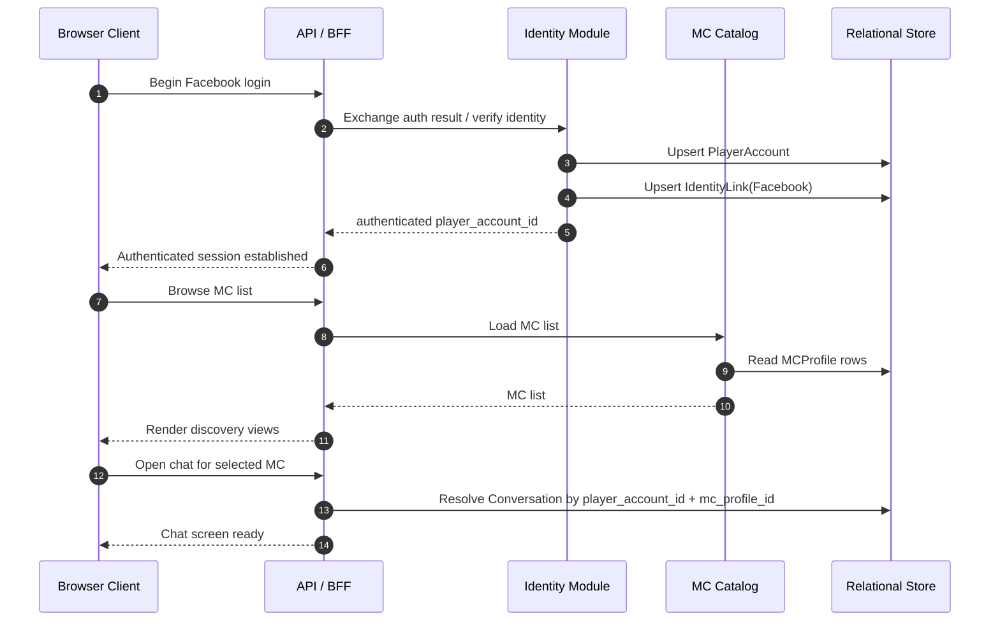
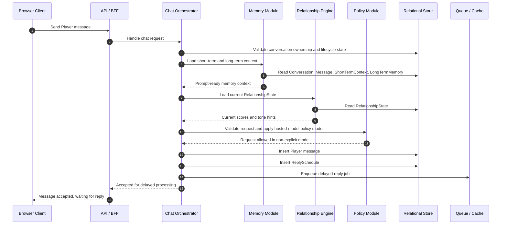
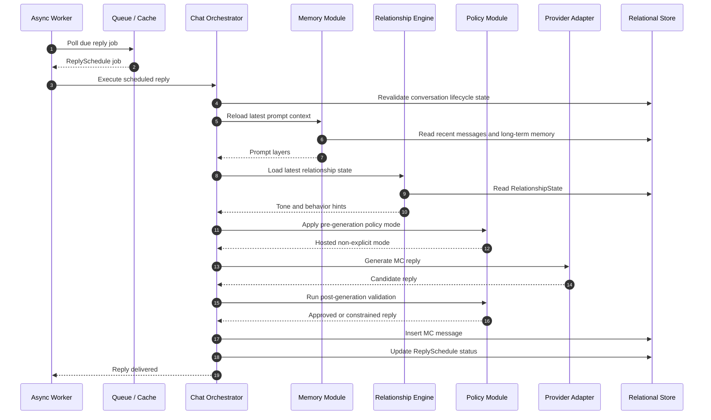
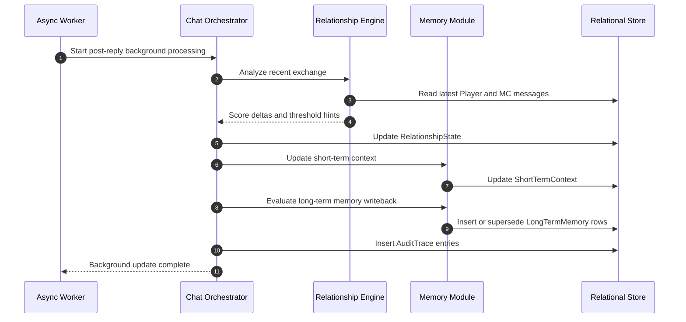
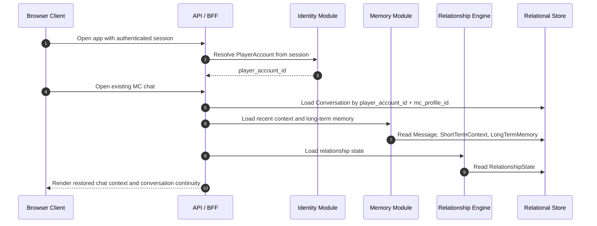
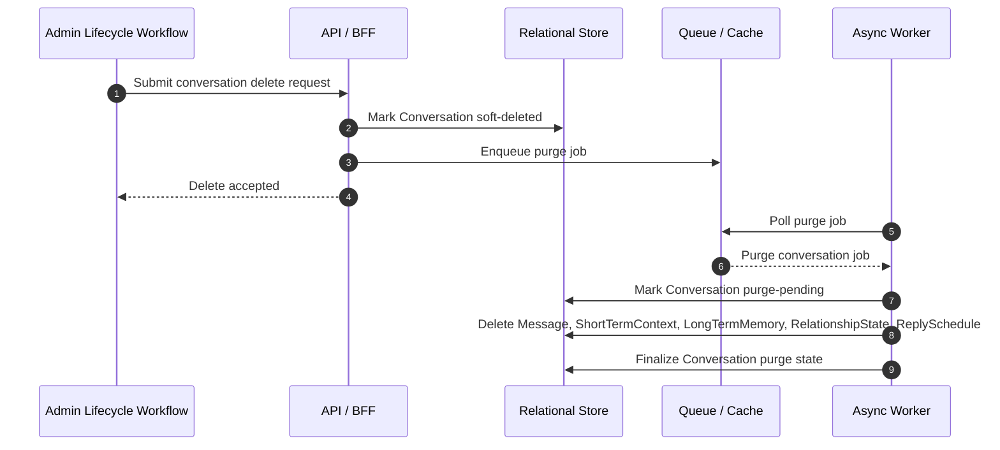

# Renai Game LLM MVP - Sequence Flows

## Document Control
- Status: Draft Sequence Flow Companion
- Version: v1.1.0
- Last Updated: 2026-04-26
- Owner: SA

## Change Log
| Date | Version | Change Type | Summary | Downstream Impact |
| --- | --- | --- | --- | --- |
| 2026-04-26 | v1.1.0 | Major | Reconciled the sequence flows to PRD v3.0.2 by removing guest flows, adopting Player and MC terminology, and modeling the approved retention and admin-managed deletion behavior. | API contracts, worker jobs, and implementation planning should use these flows as the runtime reference for the updated phase 1 system. |
| 2026-04-26 | v1.0.0 | Major | Established the sequence-flow companion as a managed architecture artifact. | Technical Lead planning should continue to use these flows as part of the Architecture v1.0.0 runtime baseline. |

## Upstream Baseline
- Based On: Phase 1 MVP PRD v3.0.2, MVP HLD v1.1.0, and MVP ERD v1.1.0

## Executive Summary
This document captures the main runtime sequence flows for the phase 1 MVP system. It complements the HLD and ERD by showing how the browser client, backend modules, storage layers, scheduler, and LLM provider interact during the most important product journeys in the authenticated-only phase 1 model.

The focus is on the approved MVP behavior:
- Player authentication before chat
- one-on-one Player-to-MC chat only
- delayed human-like replies
- conversation-scoped memory
- hidden phase 1 relationship scores
- admin-managed deletion and purge behavior

## Source Notes
- `docs/01_requirements/renai-game-llm-prd.md`
- `docs/02_architecture/renai-game-llm-mvp-hld.md`
- `docs/02_architecture/renai-game-llm-mvp-erd.md`
- `docs/02_architecture/renai-game-llm-mvp-privacy-retention-architecture.md`

## Participants
| Participant | Role |
| --- | --- |
| Browser Client | Responsive browser app used by the Player |
| API / BFF | Client-facing backend entrypoint |
| Identity Module | Facebook identity resolution and session handling |
| MC Catalog | Loads MC profile and discovery metadata |
| Chat Orchestrator | Coordinates chat request processing |
| Policy Module | Enforces hosted-model non-explicit and safety restrictions |
| Relationship Engine | Loads and updates relationship state |
| Memory Module | Loads and updates short-term and long-term memory |
| Provider Adapter | Normalized access to hosted public LLM |
| Async Worker | Executes delayed replies and background jobs |
| Relational Store | Persistent relational database |
| Queue / Cache | Delayed jobs and transient scheduling state |
| Admin Lifecycle Workflow | Internal or admin-managed delete trigger |

## Flow 1: Player Login And Enter MC Chat
### Purpose
Shows how a Player authenticates and enters a one-on-one chat with an MC.

## Flow 2: Player Message Send And Delayed Reply Scheduling
### Purpose
Shows how the system accepts an authenticated message, assembles context, applies policy, and schedules a delayed reply.

## Flow 3: Delayed Reply Execution Through Hosted LLM
### Purpose
Shows how the worker executes the scheduled reply, calls the provider, applies policy checks, and delivers the MC reply.

## Flow 4: Post-Reply Memory And Relationship Update
### Purpose
Shows how relationship state and memory are updated after a completed exchange without blocking the visible user experience.

## Flow 5: Returning Player Reopens Existing MC Chat
### Purpose
Shows how a returning authenticated Player gets continuity with the same MC.

## Flow 6: Admin-Managed Delete And Purge
### Purpose
Shows how internal or admin-managed deletion blocks access immediately and then completes asynchronous purge.

## Sequence Design Notes
### Why Authentication Is Modeled Up Front
The current PRD requires login before chat. Modeling this boundary explicitly prevents downstream planning from preserving guest-era API or persistence shapes.

### Why Policy Is Checked Before And After Generation
Pre-generation policy shapes the request sent to the provider. Post-generation policy catches output that still falls outside the approved non-explicit phase 1 posture.

### Why Lifecycle State Must Be Checked Inside The Worker
Delayed replies and purge jobs are asynchronous. By the time a job becomes due, the owning conversation may already be deleted or inaccessible.

### Why Admin-Managed Delete Is Explicitly Modeled
Deletion is part of the approved phase 1 policy baseline, even though it is not Player self-service. The runtime contract must therefore show how delete intent blocks access immediately and how purge completes later.

## Cross-Document Consistency Checks
This sequence document is consistent with the companion architecture artifacts in these ways:
- matches the modular monolith plus async worker design in the HLD
- uses the conversation-centric persistence model from the ERD
- preserves per-Player-per-MC memory isolation from the PRD and HLD
- preserves the fixed phase 1 retention and deletion model from the privacy architecture
- preserves the hosted-model non-explicit posture from ADR-0001

## Recommendation Summary
Recommendation:
Use these sequences as the runtime contract for implementation planning. The API contracts, worker jobs, and lifecycle enforcement logic should be derived directly from these authenticated-only phase 1 flows.
